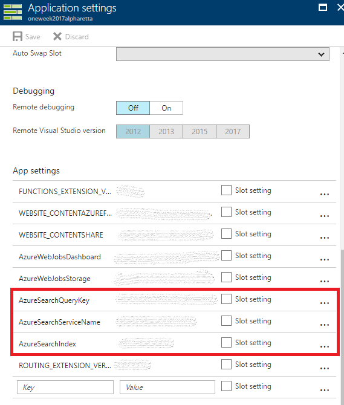

# Azure Functions API

## Use the API
There are two calls that can be made with this API. 

### GET GetChildCareServicesList
Returns a JSON array of terms that can be searched in the GetChildCareProviders call.

Example and current options:
```json
["FacilityType","Latitude","Longitude","CloseToTransit","Infants","Toddlers","Preschool","PreK","SchoolAge","Accreditation","HasEveningCare","HasDropInCare","AcceptsSubsidy","OperatingDays"]
```

### POST GetChildCareProviders
Send it a JSON like the examples below to search the database and recieve JSON of the rows. 

```json
{
    "FacilityType": "Childcare",
    "Latitude": 33.78356,
    "Longitude": -84.10318,
    "CloseToTransit": false,
    "Infants": true,
    "Toddlers": true,
    "Preschool": true,
    "PreK": true,
    "SchoolAge": true,
    "Accreditation": "SACS",
    "HasEveningCare": false,
    "HasDropInCare": true,
    "AcceptsSubsidy": true,
    "OperatingDays": "MO TU WE TH FR"
}
```

or

```json
{
    "Latitude": 33.78356,
    "Longitude": -84.10318
}
```

or any combination of key,value pairs using the keys listed above.

You'll recieve something like this:

```json
{
    "Count": null,
    "Coverage": null,
    "Facets": null,
    "Results": [
        {
            "Score": 1,
            "Highlights": null,
            "Document": {
                "id": "CCLC-1093",
                "Facility": "Creekstone Academy",
                "FacilityType": "Childcare",
                "PhoneNumber": "(770) 879-9700",
                "AddressLine1": "475 South Deshon Rd.",
                "City": "Lithonia",
                "State": "GA",
                "ZipCode": "30058",
                "Latitude": 33.78356,
                "Longitude": -84.10318,
                "CloseToTransit": "False",
                "Infants": "True",
                "Toddlers": "True",
                "Preschool": "True",
                "PreK": "True",
                "SchoolAge": "True",
                "ProgramType": "Child Care Learning Center",
                "Accreditation": "SACS",
                "HasEveningCare": "False",
                "HasDropInCare": "True",
                "AcceptsSubsidy": "True",
                "OperatingDays": "MO TU WE TH FR",
                "Location": {
                    "Latitude": -84.10318,
                    "Longitude": 33.78356,
                    "IsEmpty": false,
                    "Z": null,
                    "M": null,
                    "CoordinateSystem": {
                        "EpsgId": 4326,
                        "Id": "4326",
                        "Name": "WGS84"
                    }
                }
            }
        }
    ],
    "ContinuationToken": null
}
```

## Use the Azure Function
Fork the Azure Function Repo to try it out or use it in another project. Note: You'll need to setup an Azure Search to use this "out of the box". 

### Add App Settings Keys

Open up the Application settings blade and add:
1) `AzureSearchQueryKey`
2) `AzureSearchServiceName`
3) `AzureSearchIndex` (which is the name of the index used)



### Add Proxies to expose 

Open up the Proxies tab and add new proxies with desired Routes, HTTP methods, and the Backend URL copied from the Azure Function URL (button at the top of each Function).

